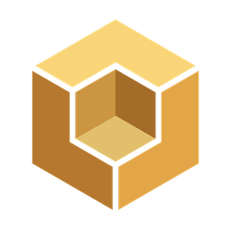
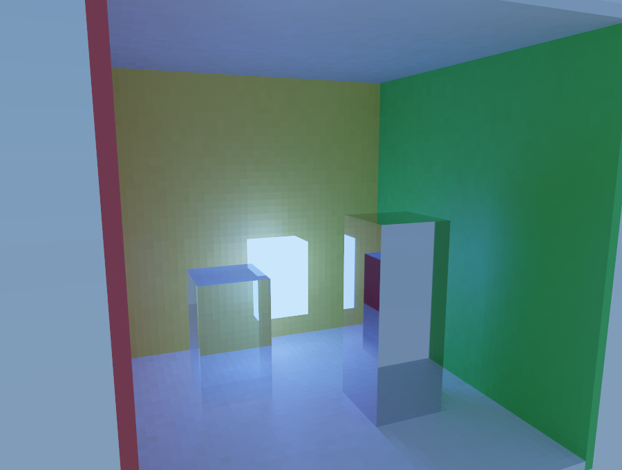
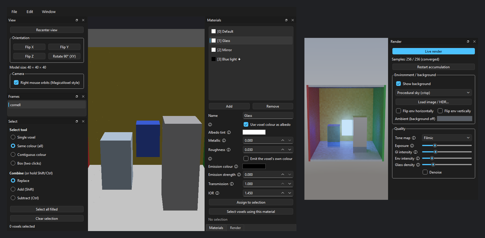

<div align="center">



# Voxmat

**Per-voxel PBR &amp; global-illumination material editor for voxel models**

[](https://github.com/HollaFoil/Voxmat/releases/latest)
[](https://github.com/HollaFoil/Voxmat/actions/workflows/release.yml)
[](LICENSE)


</div>

Voxmat is a per-voxel material editor for grid-based voxel models. It imports a
sliced image (a strip or grid of square layers), assigns real PBR + global-illumination 
materials to individual voxels, and provides export functionality for our `.mmvox` format.
> It does not provide for functionality typical meshed model formats, as the tool was made only for internal project use. PRs for converters into common formats are welcome.

Voxmat can handle sliced-image exports from MagicaVoxel, adding per-voxel material
control that MagicaVoxel does not provide on its own: distinct emission, metalness,
roughness, transmission, and index of refraction across a single model. A torch's
wooden stick and its flame, for example, can carry completely different materials.



*The bundled sample `samples/cornell_box.mmvox` rendered in Voxmat. It is also the
default location of the Open and Export dialogs.*

## Install & run

Download a build from the [Releases](../../releases) page, unzip it, and run
`Voxmat` (`Voxmat.exe` on Windows) — no Python needed.

To run from source (Python 3.11+, an OpenGL 3.3 GPU):

```bash
python -m venv .venv
source .venv/bin/activate      # Linux / macOS
.venv\Scripts\activate         # Windows (PowerShell / cmd)
pip install -r requirements.txt
python run.py
```

## Building

```bash
pip install pyinstaller
pyinstaller voxmat.spec
```

Produces a standalone app in `dist/Voxmat/`.

## Usage

1. **Import** — File → Import sliced image (`Ctrl+I`). Select the PNG(s) and
   confirm how the slices are laid out (see *Sliced image format*).
2. **Navigate** — right-drag orbits, middle-drag pans, the wheel zooms. The View
   panel can recenter the camera, flip/rotate the model, and move orbit to the
   left mouse button.
3. **Select voxels** — with the Select panel: single voxel, whole colour,
   contiguous colour (flood fill), or box. Hold Shift to add, Ctrl to subtract.
4. **Assign materials** — in the Materials panel, create a material, set its
   properties, and Assign to selection. Undo/redo with `Ctrl+Z` / `Ctrl+Y`.
5. **Preview** — the Render panel's Live render shows the model lit in real time
   (see *Rendering*).
6. **Save & export** — File → Export .mmvox (`Ctrl+E`); reopen with Open .mmvox
   (`Ctrl+O`).

> Functionality for voxel editing, where users would be able to place/color/shade voxel models, and do other common voxel modelling operations, is currently being developed.

## Rendering

The Render panel previews the model with global illumination, so materials read roughly
the way they will once imported elsewhere (of course, depending on implementation details): emissive voxels light their
surroundings, metals reflect, and glass transmits and refracts. Lighting comes
from an HDRI image, a procedural sky, or a flat ambient colour. Background, tone
map, exposure, GI and environment intensity, and glass density are all adjustable.

> The preview can be detached into its own window (Window → Open render window).



*The bundled sample `samples/cornell_box.mmvox` rendered in the Voxmat editor panels. 
The render window is detached, both rasterized and raytraced views are synced and rendered at once*

## Sliced image format (input)

A frame image is a strip or grid of square slices; each slice is one XY layer, and
the slices step through Z. A voxel is empty where the pixel's `alpha` is at or below
the configured threshold. The image dimensions imply the model size:

| Image size | Model        |
|------------|--------------|
| 16 × 256   | 16³          |
| 32 × 1024  | 32³          |
| 48 × 2304  | 48³          |

Animations are supported either as one file per frame, or as a single tall image
with the frames stacked (for example, 16 × 1024 is four 16³ frames).

Import options (see [`voxmat/io/image_import.py`](voxmat/io/image_import.py),
`ImportConfig`):

- `slice_w`, `slice_h`, `slice_count` — 0 means auto (square slices from width).
- `layout` — vertical strip (default), horizontal strip, or grid (`grid_cols`).
- `frame_source` — a single multi-frame image (`frame_count`) or one file per frame.
- `flip_x/y/z`, `swap_xy` — reconcile differing axis conventions (e.g. Z-up vs
  Y-up) and slice ordering.
- `alpha_threshold` — the alpha value at or below which a pixel is treated as empty.

## `.mmvox` binary format (output)

A little-endian, versioned, sparse format intended to be read by an external
importer (such as a game-engine import script). The authoritative specification and
struct definitions live in [`voxmat/io/formats.py`](voxmat/io/formats.py). Summary:

```
"MMVX", u16 version, u16 flags, u16 X, u16 Y, u16 Z, u16 frame_count, u16 material_count
material_table[material_count]:
    u16 id; u8 nameLen; utf8 name; u8 use_voxel_color;
    f32x4 albedo; f32 metallic; f32 roughness;
    f32x3 emission_color; f32 emission_strength; f32 transmission; f32 ior;
    u32 flags; u16 extraCount; extraCount x { u8 keyLen; utf8 key; f32 value }
frames[frame_count]:
    u8 nameLen; utf8 name; u32 voxelCount;
    voxelCount x { u16 x, y, z; u16 material_id; u8 r, g, b, a }
```

> `material_id` 0 is the reserved default material. The `extra` float map and the
`flags` bitfield are the forward-compatible extension points.

## Project layout

```
voxmat/
  core/    data model: voxels, frames, materials, selection, document
  io/      sliced-image import and .mmvox read/write
  render/  path tracer and environment-map loading
  ui/      PySide6 application, 3D viewport, and dock panels
```
